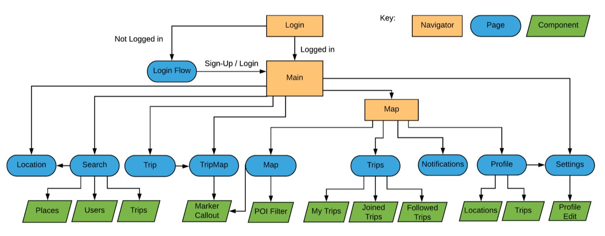
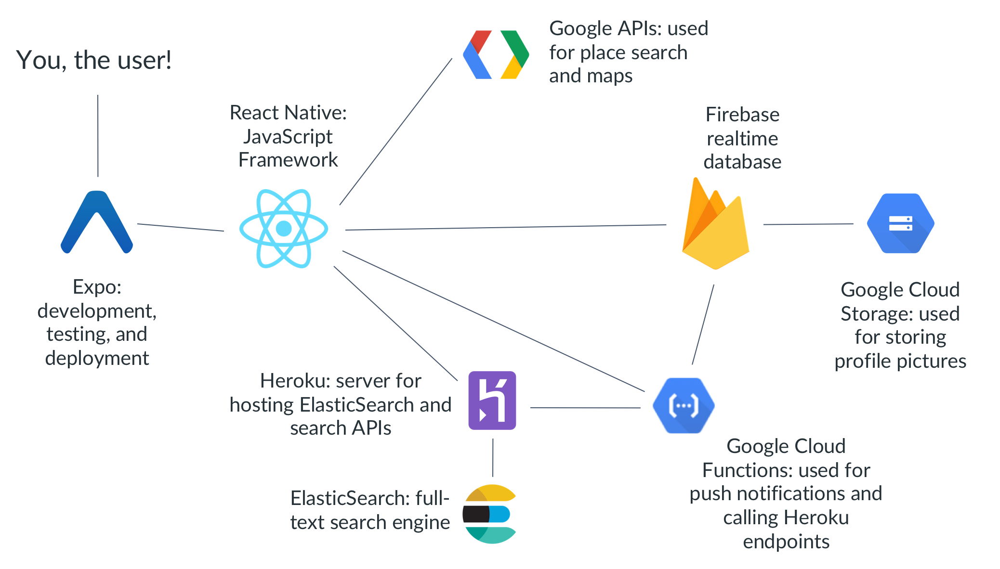
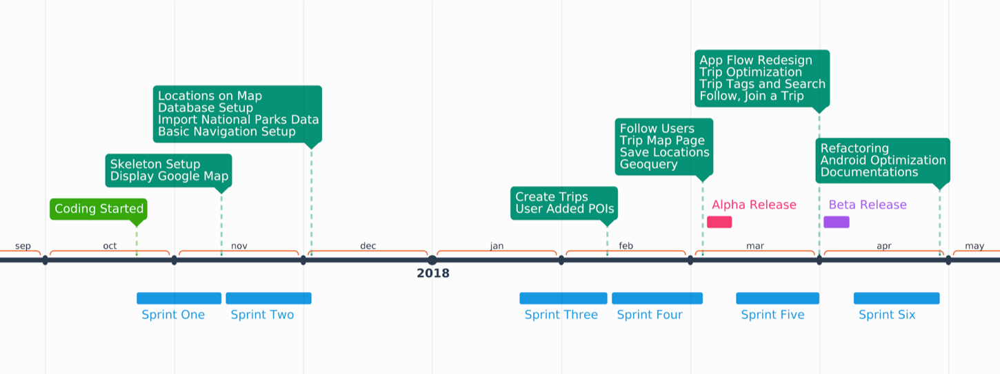

## **_Original Problem Statement_**

"This project comes from my personal experience traveling the US to visit national parks. I was looking on the google play store for an app to track which national parks we have seen vs. not seen. I assumed there would be an app that could track this for us and maybe even present a map or visualization of our progress that I could share on Facebook. This app doesn’t exist at the moment (some similar sites exist like travbuddy.com, but this isn’t exactly easy to use or very powerful). So, we should create it but why limit it to national parks?

I would like to develop an app/web platform where users can create a list of places to visit or things to do. Then other users can sign up for these lists and track their progress. We could build in national parks, national monuments, even restaurants in Lewisburg. But the best feature would be users could create new lists. This would allow very diverse and interesting lists to be created everything from Civil War battlefields to national ballparks. The site would have allow searching for nearby sites (geotagged) and leaderboards with statistics about who is in each challenge along with nice visualizations and social media connections." Prof. Alan Marchiori

## **_Design Revisions_**

* Challenges were removed from the list of desired features halfway through production, as there was no satisfactory solution found that fit the feel or theme of the app.
* The ability to create, optimize, share, follow, and join trips was added in the place of challenges, and to satisfy the lists request. Allowing users to coordinate trips without the point or leaderboard system.
* The final design ended up being entirely mobile based, there is no option for a web based platform as of launch.
* Expansion beyond just parks and national parks. Any point of interest that appears in Google Maps can be put into a trip.
* User created trips are not public by default, instead a user can create private trips, trips shared only with friends, and public trips.
* Instead of representing trip completion on the map, which would involve extensive revisions to accommodate mapping directions, we elected to simply record individual locations as visited or not.
	* Directions can be found using a provided re-direct from our app to Google Maps.

## **_Background & Motivation_**
* Make the process of creating and keeping track of trips easier.
* Browse different types of points of interest nearby you (for inspiration during a trip).
* Collaborate on trips with friends.
* Get ideas for fun new trips you wouldn’t have known about!

## **_Design_**
### User Interface Design Diagram

*This diagram shows the navigation among different screens of our app. The navigators (orange) connects pages in that level through either stack or tab navigator. The pages (blue) represents different screens of our app, which utilize reusable components (green).*

### System Level Design Diagram

*This diagram shows the system level design of our app. Right now users can access our app through downloading Expo Client on their iOS/Android devices. Our front-end is written using React Native, a JavaScript framework that allows us to build cross-platform apps. Our back-end mostly relies on Firebase services, including Realtime Database (most of our data such as locations, trips, and users), Cloud Storage (user profile images), and Cloud Functions (serverless backend code). ElasticSearch is deployed on Heroku (Bonsai addon) and is used to implement full text search functionalities that Firebase is lack of. We also utilized a variety of Google APIs for maps, places search, distance calculation, and directions.*

## **_Implementation_**

* React Native
  * react-native-maps: displaying map with markers and callouts on our main screen as well as trip's map page
  * react-native-vector-icons: a collection of nice looking icons used in our app
  * react-navigation: supports the navigation between different screens through stack and tab navigator
* Firebase
  * Authentication: user signup/login as well as third party login (Google and Facebook)
  * Realtime database: JSON format database for storing locations, trips, and users data
  * Cloud storage: file storage service from Google Cloud Platform to store user profile images
  * Cloud functions: back-end code without server that can be triggered by database updates or http requests
* ElasticSearch and Heroku
  * ElasticSearch is used because Firebase does not support full text search. 
  * ElasticSearch database is updated by cloud function that listens to firebase realtime database changes
  * Heroku is used to host ElasticSearch as well as express (nodejs) APIs for searching requests
* Google APIs
  * Places: nearby places search for user added POIs
  * Distance: for calculating distance between POIs and trip optimization
  * Waypoints: for directions

## **_Demo & Results_**

### Major Tasks Completed

* Fully interactable map with visual POIs, ability to add new locations, geo-query for location and screen size based rendering, and detailed callouts for each POI redirecting to a location information page.
* Profile page with relevant information for followers, favorite locations, profile image, user handle, users public trips.
* Trip page with ability to edit, rename, reorganize locations, and optimize trips. Each trip also includes a distance calculator to allow the user to see how their edits will change the final trip length.
* Trip optimization to efficiently reorganize all locations so that the overall trip length is at a minimum.
* Intuitive searches for locations, trips, and users based off of names, and tags.
* Push notifications to alert a user for follow request and join trip request.
* Trip map, allows users to see only the pins that are relevant to their trip.
* Third party login and verification, utilizing Gmail and Facebook to sign up for Xplor.

### Feature Demos

*Users can create a new account for our app, or login through their Google or Facebook accounts.*

 

*Users can add locations that exist in the Google Places API, filter results by category, and add it to our database.*

 

*Users can create trips through trips screen or a location’s detail page, add tags and permissions, and add locations through search or from the map page.*

 

*Users can search for locations (full-text), users (by handle), and trips (by tag) using the search bar accessible from everywhere.*

 

*Users can request to join a trip by permission of the trip creator, or simply follow a trip.*

 

## **_Development Process & Challenges_**

* Timeline

* Challenges
  * Cross platform style differences
    * Layout changes between Android and iOS
    * Use and interaction differences
  * Trip optimization
    * Utilizing Google Waypoints and Distance API
  * Making the app more social
    * Allowing users to follow and join trips
    * Push notifications for user interaction
  * Editing, creating, and making new trips and POIs
    * Giving the user control over their trips and our POIs
  * Documenting and refactoring the app
    * Documenting every file, folder, and DB layout for future developers
    * Making sure all code was easily understandable

## **_Conclusion & Reflection_**

* What we enjoyed?
  * Building on previously learned React Native knowledge
  * Seeing our application working smoothly
  * Utilizing new libraries and APIs(but not too frequently)
  * Learning new coding practices (asynchronous functions)
  * Learning a new development flow
  * Time management for a large scale project

* What we'd do differently?
  * Better time management
  * More testing of the application 
  * Documenting early and along the way 
  * Pair Programming 

* What we'd add if we have more time?
  * Integration with Social Media 
  * Fixing a few bugs 
  * Deploying our app to Google Play and Apple Store 
  * Exporting our database to Mongo 

## **_Acknowledgements_**

Thank you [Professor Alan Marchiori](mailto:amm042@bucknell.edu) for being both our client and advisor during this senior design project.

## **_Dev Build Instructions_**

* Initial requirements
	* NPM - Node Package Manager
	* Expo XDE - Installed on your workstation
	* Expo (Expo Project) - Installed on your mobile device
* On first download open NPM and run “npm install”
	This will install all requirements listed xplor package.json
	* All packages must be successfully installed, as reported by NPM, for the app to successfully run
* In the Expo XDE, select “Open existing project…”
* Select the xplor project folder
	* The project should automatically load in Expo, wait for the “Project opened!” message
* Once the message has displayed locate the three buttons in the upper right corner. (Publish, Share, Device)
	* Publish - Pushes the app to the Expo app for testing. Note, no console commands will be printed using this method.
	* Share - Presents the user with a QR code and link that you can use in the Expo app to navigate to a testing environment. The console will print out all issues using this method.
	* Device will push the app to a connected device. The console will also work with this method.

## **_Javascript Files_**

<table>
  <tr>
  <th>File</th>
  <th>Description</th>
  </tr>
  <tr>
  <td colspan="2"><i>xplor/LoginScreens</i></td>
  </tr>
  <tr>
  <td> button.js</td>
  <td> Contains the button class and style sheet used in this section</td>
  </tr>
  <tr>
  <td> logo.js</td>
  <td> Contains the logo class and style sheet</td>
  </tr>
  <tr>
  <td colspan="2"><i>xplor/LoginScreens/Login</i></td>  
  </tr>
  <tr>
  <td> ForgotPwd.js</td>
  <td> Contains function to send a password reset email, leading to the reset password page</td>
  </tr>
  <tr>
  <td> ResetPwd.js</td>
  <td> Contains the page and functionality for the user to reset their password</td>  
  </tr>
  <tr>
  <td> loginForm.js</td>
  <td> Contains the default login page layout and function, including redirects to other pages</td>  
  </tr>
  <tr>
  <td> loginLogo.js</td>
  <td> Contains the login logo and relevant style sheet</td>  
  </tr>
  <tr>
  <td> loginOther.js</td>
  <td> Contains the redirect for Facebook and Gmail sign in</td>  
  </tr>
  <tr>
  <td colspan="2"><i>xplor/LoginScreens/Signup</i></td>  
  </tr>
  <tr>
  <td> signupConfirm.js</td>
  <td> Contains the page to redirect users to their email for sign up confirmation</td>
  </tr>
  <tr>
  <td> signupDone.js</td>
  <td> Contains the sign up completion page</td>
  </tr>
  <tr>
  <td> signupEmail.js</td>
  <td> Contains functions to check email validity and uniqueness</td>
  </tr>
  <tr>
  <td> signupHandle.je</td>
  <td> Contains functions to check handles validity and uniqueness</td>
  </tr>
  <tr>
  <td> signupName.js</td>
  <td> Contains the page to input your name</td>
  </tr>
  <tr>
  <td> signupPwd.js</td>
  <td> Contains the page to input your password as well as password strength verification</td>
  </tr>
  <tr>
  <td colspan="2"><i>xplor/components</i></td>
  </tr>
  <tr>
  <td> CategoryFilter.js</td>
  <td> Component to allow a user to select filters that limit the types of POIs shown on the map</td>
  </tr>
  <tr>
  <td> ContentGrid.js</td>
  <td> Component to format a grid, used in displaying user's favorited locations</td>
  </tr>
  <tr>
  <td> CustomPinSearch.js</td>
  <td> Component to allow users to add their own POIs to the Firebase database, and functions to verify that the POIs exist in Google Places API to ensure validity</td>
  </tr>
  <tr>
  <td> MapMarkerCallout.js</td>
  <td> Component to display a preview of the POI's information and image upon pin selection</td>
  </tr>
  <tr>
  <td> NewTagModal.js</td>
  <td> Component for users to add new tags to a trip</td>
  </tr>
  <tr>
  <td> SavedLocations.js</td>
  <td> Component utilizing the content grid for saved locations</td>
  </tr>
  <tr>
  <td> SearchFilterContainer.js</td>
  <td> Component to house search filtered search results</td>
  </tr>
  <tr>
  <td> SearchFilterOption.js</td>
  <td> A component representing a possible category filter and how many locations under this category exist in a query</td>
  </tr>
  <tr>
  <td> SearchPlaces.js</td>
  <td> Component to handle searching</td>
  </tr>
  <tr>
  <td> SearchTags.js</td>
  <td> Component to handle the tag search feature</td>
  </tr>
  <tr>
  <td> SearchUsers.js</td>
  <td> Component to handle the user search feature</td>
  </tr>
  <tr>
  <td> Tag.js</td>
  <td> Component for tags</td>
  </tr>
  <tr>
  <td> Tags.js</td>
  <td> Functions to add and remove tags</td>
  </tr>
  <tr>
  <td> TagsArea.js</td>
  <td> Component for the tags display</td>
  </tr>
  <tr>
  <td> TripContainer.js</td>
  <td> Component used to house trips and associated information</td>
  </tr>
  <tr>
  <td> TripsList.js</td>
  <td> Component to display a trips list</td>
  </tr>
  <tr>
  <td> UserTrips.js</td>
  <td> Contains functions to load trips, add location to trips, and for rendering the prior trip components into one feature</td>
  </tr>
  <tr>
  <td colspan="2"><i>xplor/components/Notifications</i></td>
  </tr>
  <tr>
  <td> FollowApproval.js</td>
  <td> Component to display an approval for a follow user request</td>
  </tr>
  <tr>
  <td> FollowRequest.js</td>
  <td> Component to display a follow user requests, and functions to approve or deny request and send approval notification</td>
  </tr>
  <tr>
  <td> JoinTripApproval.js</td>
  <td> Component to display an approval for a join trip request</td>
  </tr>
  <tr>
  <td> JoinTripRequest.js</td>
  <td> Component to display a join trip requests, and functions to approve or deny request and send approval notification</td>
  </tr>
  <tr>
  <td> push_listener.js</td>
  <td> Used to handle notifications received while the app is open or is opened after closing</td>
  </tr>
  <tr>
  <td colspan="2"><i>xplor/functions</i></td>
  </tr>
  <tr>
  <td> FirebaseTripCode.js</td>
  <td> Contains the first iteration of functions used to construct trips in Firebase. No longer implemented</td>
  </tr>
  <tr>
  <td> index.js</td>
  <td> Initialize the Firebase configuration.</td>
  </tr>
  <tr>
  <td> location_to_geo.js</td>
  <td> Contains functions to grab points from the Firebase database and convert them into geofire points</td>
  </tr>
  <tr>
  <td> nps_poi.js</td>
  <td> Contains the functions to grab information from the national park service and push them to Firebase</td>
  </tr>
  <tr>
  <td> push_code.js</td>
  <td> Contains the function to implement registration for push notifications</td>
  </tr>
  <tr>
  <td colspan="2"><i>xplor/navigators</i></td>
  </tr>
  <tr>
  <td> LoginNav.js</td>
  <td> Contains all constants necessary to operator the navigator leaving the login page and going to all singup options, logins, forgot/reset password, and the central page</td>
  </tr>
  <tr>
  <td> MainNav.js</td>
  <td> Contains all constants necessary to operator the central navigator, including the redirects to all main pages, including map, search, profile, trips, following, create trip, location page, tag page, and settings</td>
  </tr>
  <tr>
  <td> MapNav.js</td>
  <td> Contains all constants necessary for naviagtion out of the map page </td>
  </tr>
  <tr>
  <td colspan="2"><i>xplor/network</i></td>
  </tr>
  <tr>
  <td> notifications.js</td>
  <td> Contains all functions for interaction with the Firebase database for sending and deleting notifications</td>
  </tr>
  <tr>
  <td> pois.js</td>
  <td> Contains all functions for interaction with the Firebase database for creating, searching, and getting details about pois</td>
  </tr>
  <tr>
  <td> trips.js</td>
  <td> Contains all functions for interaction with the Firebase database for creating, editing, adding to, and managing trips; also includes the route optimization and route distance calculator</td>
  </tr>
  <tr>
  <td> users.js</td>
  <td> Contains all functions for interaction with the Firebase database for user authetication, profile info editing, and getting users data</td>
  </tr>
  <tr>
  <td colspan="2"><i>xplor/pages</i></td>
  </tr>
  <tr>
  <td> Contains all pages in the app</td>
  <td> This folder contains all javascript files to implement every page in the app. The names of the files are labeled to clearly indicate which page they correlate to. These pages implement all components and functions relevant to operate their individual pages, and also implement their own unique functions for navigation, and unique database calls.</td>
  </tr>
  <tr>
  <td colspan="2"><i>xplor/utils</i></td>
  </tr>
  <tr>
  <td> colors.js</td>
  <td> Contains a standardized list of all colors used in the app</td>
  </tr>
  <tr>
  <td> poiTypes.js</td>
  <td> Contains a standardized stylesheet for all poi types used on the map</td>
  </tr>
  <tr>
  <td colspan="2"><i>xplor</i></td>
  </tr>
  <tr>
  <td> App.js</td>
  <td> Entry point of the app, contains all information required for Expo to build and launch the app</td>
  </tr>
</table>

## **_Firebase Structure_**

<table>
  <tr>
  <th>Tables/Entries</th>
  <th>Description</th>
  </tr>
  <tr>
  <td colspan="2"><i>xplor/pois</i></td>
  </tr>
  <tr>
  <td> Location codes</td>
  <td> Contains all of the locations and their unique information. The IDs are unique location IDs pulled from Google.</td>
  </tr>
  <tr>
  <td colspan="2"><i>xplor/pois/Unique-IDs</i></td>
  </tr>
  <tr>
  <td> description</td>
  <td> A short description for each location</td>
  </tr>
  <tr>
  <td> id</td>
  <td> Identical to the unique identifier at the top level for POIs</td>
  </tr>
  <tr>
  <td> image</td>
  <td> A url linking to an image for the destination</td>
  </tr>
  <tr>
  <td> lat</td>
  <td> The locations latitude</td>
  </tr>
  <tr>
  <td> long</td>
  <td> The locations longitude</td>
  </tr>
  <tr>
  <td> name</td>
  <td> The destinations name</td>
  </tr>
  <tr>
  <td> type</td>
  <td> This is used for sorting all POIs into specific categories for sorting on the map. These are: National Park, National Monument, Park, Museum, Amusement Park, Aquarium, Gallery, Bar, Campground, Library, Restaurant, Theater, Stadium, Zoo, Others</td>
  </tr>
  <tr>
  <td colspan="2"><i>xplor/tags</i></td>
  </tr>
  <tr>
  <td> User entered tags</td>
  <td> Each of these entries contain the count of how many trips include this tag, and the ID for each of these trips</td>
  </tr>  
  <tr>
  <td colspan="2"><i>xplor/trips</i></td>
  </tr>
  <tr>
  <td> Trip codes</td>
  <td> Contains all of the trips and their uniquely generated ID, along with all of their relevent information</td>
  </tr>
  <tr>
  <td colspan="2"><i>xplor/trips/Unique-IDs</i></td>
  </tr>
  <tr>
  <td> creator</td>
  <td> The uniquely generated user ID from the original trip creator</td>
  </tr>
  <tr>
  <td> followers</td>
  <td> The unique user ID for all of the trips followers</td>
  </tr>
  <tr>
  <td> locations</td>
  <td> Contains all of the location IDs, and each location contains it's index, name, and whether or not it has been visited</td>
  </tr>
  <tr>
  <td> name</td>
  <td> The trips name</td>
  </tr>
  <tr>
  <td> numLocs</td>
  <td> How many locations the trip has</td>
  </tr>
  <tr>
  <td> participants</td>
  <td> The unique user ID for all of the trips participants</td>
  </tr>
  <tr>
  <td> permission</td>
  <td> Who is allowed to see the trip: everyone, only you, and followers</td>
  </tr>
  <tr>
  <td> tags</td>
  <td> All tags for this trip</td>
  </tr>
  <tr>
  <td colspan="2"><i>xplor/users</i></td>
  </tr>
  <tr>
  <td> handles</td>
  <td> Contains all of the users handles paired with their unique IDs</td>
  </tr>
  <tr>
  <td colspan="2"><i>xplor/users/main</i></td>
  </tr>
  <tr>
  <td> firstname</td>
  <td> The firstname provided at signup</td>
  </tr>
  <tr>
  <td> handle</td>
  <td> The user's chosen handle</td>
  </tr>
  <tr>
  <td> lastname</td>
  <td> The lastname provided at signup</td>
  </tr>
  <tr>
  <td> numFollowers</td>
  <td> How many people are following this user</td>
  </tr>
  <tr>
  <td> numFollowing</td>
  <td> How many people this user is following</td>
  </tr>
  <tr>
  <td> saved</td>
  <td> All saved/favorited locations identified by their unique ID. Contains that locations image, and name</td>
  </tr>
  <tr>
  <td colspan="2"><i>xplor/users/notifications/player-IDs/unique-notification-ID</i></td>
  </tr>
  <tr>
  <td> data</td>
  <td> The sender's ID</td>
  </tr>
  <tr>
  <td> time</td>
  <td> The time the notification was sent</td>
  </tr>
  <tr>
  <td> type</td>
  <td> A descriptor for which type of notification was sent</td>
  </tr>
</table>
